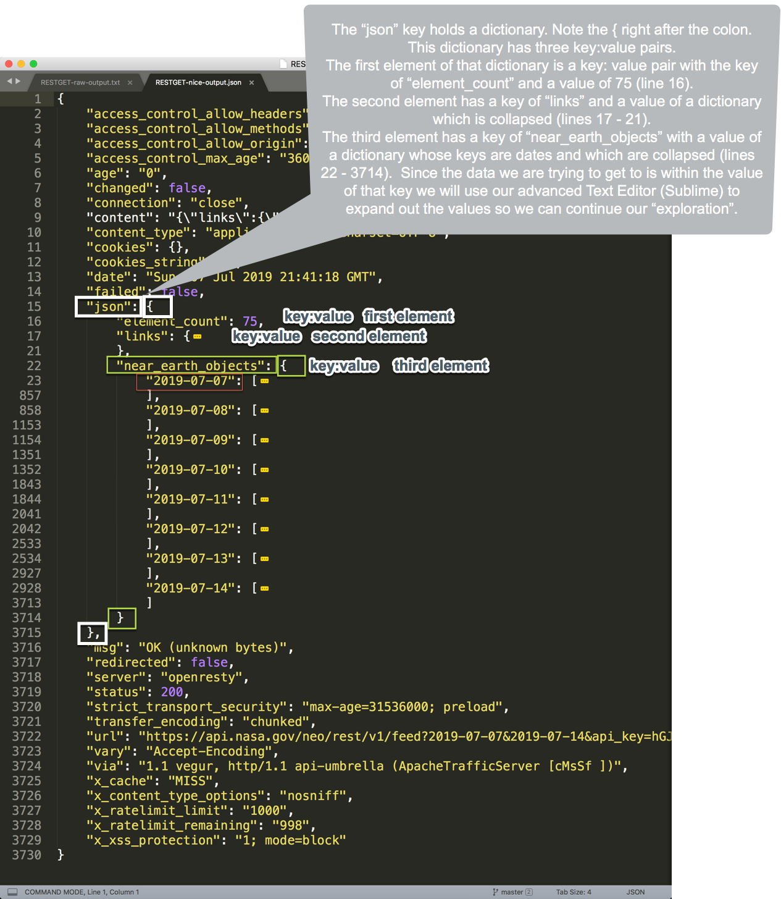
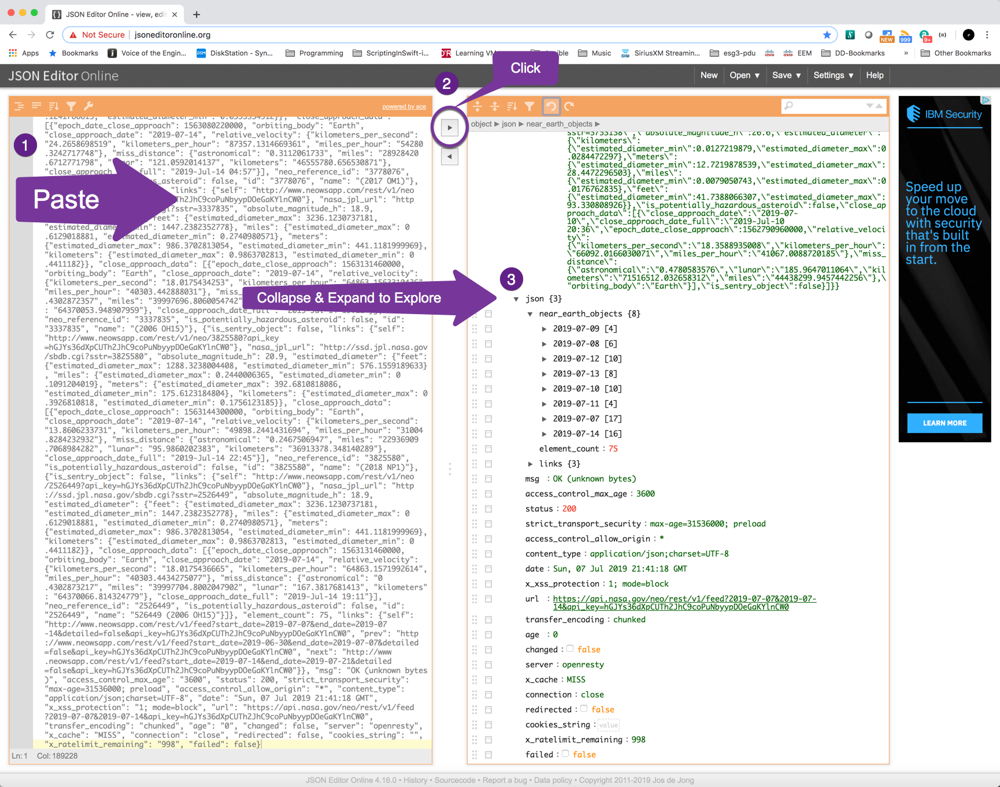

# Decomposing Data Structures

Whether you are trying to find all the tenants in an ACI fabric, or all the interface IPs and descriptions on a network device, or trying to determine if the earth is in eminent danger from an asteroid hurtling towards the planet, understanding complex data structures is a critical skill for anyone working with modern IT infrastructure technology.

As APIs become more and more prevalent, acting on an object (device, site, mangement system, etc.) will return structued data in a format you may have never seen before.  For beginners, this may be a little daunting but once you get a few basics down you will be decomosing data structures at diner parties!

Most modern APIs return data in XML or JSON format.  Some give you the option to choose.   We won't spend any time on how you get this data.  The focus today is how to interpret and manipulate data returned to you in JSON.  Not a fan of XML so if I ever run into an API that only returns XML (odd are you will too) I do my very best to convert it to JSON.  

Lets get some basics out of the way.   Braces, brackets, and spacing provide a syntax for this returned data. If you know a little Python these will be familiar to you.  

| Symbol | Meaning                                                      |
| ------ | ------------------------------------------------------------ |
| [ ]    | LIST<br />Square brackets denote a list of values will be found between the opening [ and closing ] brackets separated by commas<br />List elements are reference by the number of its position in the list so that in a list like my_list = [1,2,3,4], if you want the information in the 3rd position (the third element) which is the number 3 you say my_list[2] because lists are zero indexed and so my_list[0] is the number 1, my_list[1] is the number 2, etc. |
| { }    | DICTIONARY<br />Curly braces denote a list of key value pairs will be found between the opening { and closing } braces separated by commas with the key and value pair separated by a colon :.<br />key: value<br />Dictionary key:value pairs are reference by the key so that in a dictionary like my_dict = {'la': 'Dodgers', 'sf': 'Giants'} if you want to know the baseball team in LA you reference my_dict['la']. |


**Lists** look like this:

`[`
  `item1,`
  `item2,`
  `item3`
`]`

or

`[item1,item2,item3]`


**Dictionaries** look like this:
`{`
	`key: value,`
	`otherkey: othervalue`
`}`

or

`{key: value,otherkey: othervalue}`

The other thing to note is that when these structures are formatted, spacing is important and can tell you a lot about the hierarchy.   

The examples above are not quoted and they should be.  I didn't because I wanted to highlight that single and double quotes can be used in Python but the JSON standard requires double quotes.   

Its also important to understand that these two basic structures can be combined so that you can have a list of dictionaries or a dictionary of key:value pairs where the value is a list or a dictionary.   You can have many levels and combinations.

Lets start with a simple example.

Below is an Ansible playbook that queries and ACI fabric for the configured tenants.   


Lets look at the data that was returned, which is highlighted in a big yellow outer box in the image below.  Also highlighted are the syntax symbols that will let us decompose this structure.  As you can see from **a**, the entire structure is encased in curly braces {}.  That tells us that the outermost structure is a dictionary and we know that dictionaries provide us with a **key** (think of this as an index value) followed by a colon **:** followed by a **value**.     In this case we have a dictionary with one element or key:value pair and the value is a list.  We know its a list from **b**, which shows the opening and closing square bracket denoting a list structure.

`{"tenantlist": ["common", "mgmt", "infra", etc..]}`


This is a simple structure.  Its short so can you see the entire result in one view but has both the structures that you will encounter.


------

Lets look at something a bit more complex.  

[REST COUNTRIES](http://restcountries.eu/) provides a public REST API for obtaining information about countries.

Check them out!

- https://twitter.com/restcountries
- Get information about countries via a RESTful API [http://restcountries.eu ](http://t.co/kITGsyFEth)

Using Postman, I submitted a query about Kenya.  Below are the first 25 or so lines of the data returned.

a. Line 1 shows us the left square bracket which tells us this is a list.

b. Line 2 shows us the left curly brace which indicates that what follows is a dictionary.    Line 3 is a key:value pair. Line 4 is a key:value pair but it looks like the value of key "topLevelDomain" is a list (of one element).  Line7 returns us to a simple key:value pair.


Here is where it can start getting confusing.  Remembering our reference rules..that is: 

- you reference a list element by its zero index positional number and 
- you reference a dictionary element by its key 

Lets try to extract the two letter country code for Kenya.

So I'm going to cheat a little here to introduce you to the concept of digging in to the data structure to "pluck" out the data you want.  You really want to understand the entire data structure before doing this so I'm going to assume that this is a list with one element and that element is a dictionary of key value pairs with different information about Kenya.

That being the case, first I have to reference the element in the list.

- One element so I know I have to reference it with the zero index [0]
- Next I have to pluck out the 2 letter country code for Kenya and that is in a key:value pair with the key of 'alpha2code'

So assuming we have a variable **country_info** that has our data structure, then to reference the 2 letter country code I would need to use 

```json
country_info[0]["alpha2Code"]
```


That reference structure above would return "KE".


Lets build on this.  What if I need the country calling code so I can make a call?  For this we need to go a level deeper as the country code is in a key of "callingCodes" at the same level of "alpha2Code" but the value is a list rather than a variable.   We know how to reference a list so in this case, if I wanted the first country code in the list my reference structure would look like:

```json
country_info[0]["callingCodes"][0]
```

That would return "254" (a string)

In many cases, you might want the entire list and so to get that:

```json
country_info[0]["callingCodes"]
```

would return ["254"] as a list.  There are cases where you may want to do some specific manipulation and you need the entire list.


**Extra:**  In this repository there is a quick & dirty Python3 script **country_info_rest.py** that will let you get some country data and save it to a file.  There is also an optional "decompose function" that you can tailor to your needs to get a feel for decomposing the data structure via a script.


```json
(generic_py3_env) Claudias-iMac:claudia$ python country_info_rest.py -h
usage: country_info_rest.py [-h] [-n CNAME] [-d]

Call REST Countries REST API with a country name.

optional arguments:
  -h, --help            show this help message and exit
  -n CNAME, --cname CNAME
                        Country Name to override default (Mexico)
  -d, --decompose       Execute a function to help decompose the response

Usage: 'python country_info_rest.py' without the --name argument the script
will use the default country name of Mexico. Usage with optional name
parameter: 'python country_info_rest.py -n Singapore'. Note: this is a python3
script.


```


------

Lets look at something really complex.  

Now a word about "complex".  At this point I'm hoping you can start to see the pattern.  Its a pattern of understanding the "breadcrumbs" that you need to follow to get to the data you want.  You now know all the "breadcrumb" formats:

-  [positional number] for lists and 
- ["key"] for dictionaries  

From here on out its more of the same.   Lets see this in action with the data returned from the [NASA Asteroids - Near Earth Object Web Service](https://api.nasa.gov/api.html#NeoWS).

But first, here is why I called this "really complex".  A better term might be "long with scary data".  At least it was for me because when I first ran my first sucessful Ansible playbook and finally got data back it was like opening a shoe box with my favorite pair of shoes in it and finding a spider in the box…yes, shrieking "what IS that!" and jumping away.

I hope that by this point there is no shrieking but more of a quizzical.."Hmmm OK, I see the outer dictionary with a key of "asteroid_output" and a value of another dictionary with quite alot of keys and some odd looking stuff…lets get into it!"

…and if there is shrieking then I hope this helps get you on your way to where its quieter..


I want to pluck out the diameter of the asteroid as well as something that tells me if there is any danger to Earth.

Somewhere, in the middle of all of this output, is this section which has the data we want but where is it in reference to the start of the entire data structure?  Where are the breadcrumbs?  Hard to tell...


You can visually walk the data but for data structures of this size and with many levels of hierarchy it can be time consuming and a bit daunting.  There are a number of approaches I've tried including:

1. visually inspecting it (good for 25 lines or less otherwise yuk)
2. saving the output to a text file and opening it up in a modern text editor or IDE so that you can inspect and collapse sections to get a better understanding of the structure
3. using a Python script or Ansible playbook to decompose by trial and error
4. using a JSON editor to convert to a more readable structure and to interpret the data structure for you

I don't recommend the first approach at all unless you data is like our first example or you combine it with the Python (or Ansible) trial and error approach but this can be time consuming.  I do have to recommend doing it this way once because it really helps you understand what is going on.

Using a good editor or IDE is a good approach but for something that makes my eyes cross like the outpus above I use JSON tools.

In the two sections below I'll show you a bit more detail on approach #2 and #4.

#### Asteroid Data collapsed down in Sublime Text Editor.

Note that this has already been collapsed down to the value of the key **asteroid_output** so the outer dictionary is already stripped off.  In this view it looks a bit more managable and the values we want can be found within the

```json
asteroid_output["json"]["near_earth_objects"][date_key]
```


**asteroid_output =**




Expanding one of the date keys shows us how we might start to get to the data we want.

```json
asteroid_output["json"]["near_earth_objects"]["2019-07-07"]
```

The date key we expanded, "2019-07-07", has a value that is a list.  If we take the first element of that list we can get the estimated diameter in feet and the boolean value of "are we to go the way of the dinosaurs"

Estimated maximum diameter in feet:

```json
asteroid_output["json"]["near_earth_objects"]["2019-07-07"][0]["estimated_diameter"]["feet"]["estimated_diameter_max"]
```

Is this going to be an extinction level event?:

```json
asteroid_output["json"]["near_earth_objects"]["2019-07-07"][0]["is_potentially_hazardous_asteroid"]
```

Which will give us **false** (for that one anyway :D).


#### Using JSON tools to decompose your data structure

It is here I must confess that these days if I can't visually figure out the "breadcrumbs" I need immediately, I go to this approach.

If I'm working with non-sensitive data [JSON Editor Online](http://jsoneditoronline.org/) is my personal favorite.

I copy the output and paste it into the left window, click to analyze and format into the right window, and then I collapse and exapnd to explore the data structure and figure out the breadcrumbs that I need.  The Editor gives you additional information and element counts and has many other useful features.

One of them is allowing you to save an analysis on line so you can share it.

[Decomposing_Data_Structures_asteroid_output](http://jsoneditoronline.org/?id=6f89053f655244989b542f0ca480d93e)




There are occaisons where I'm not working with public data and in those cases I'm more comfortable using a local utility.  My go to local utility is [JSON Editor](https://apps.apple.com/us/app/json-editor/id567740330?ls=1&mt=12) from [Vlad Badea](http://jsoneditor.blogspot.com)  available on the Apple Store.  I don't have a recommendation for Windows but I know they exist and some look interesting.

For this data, the local JSON Editor application does a nicer job of representing the asteroid_output because it really collapses that hairy content value.


#### Using a Python script to decompose by trial and error

In this repository there is a rudimentary Python3 script **country_info_rest.py** which when executed with the "-d" option will attempt to walk the response from the REST Country API.

The first part of the script executes a REST Get and saves the response.  With the "-d" option it also executes a "decompose" function to help understand the response data structure.

```
Outer structure (0) levels deep:
        The data structure 0 levels deep is a <class 'list'>
        The length of the data structure 0 levels deep is 1

One level deep:
        The data structure 1 level deep is a <class 'dict'>
        The length of the data structure 1 level deep is 24

        Dictionary keys are dict_keys(['name', 'topLevelDomain', 'alpha2Code', 'alpha3Code', 'callingCodes', 'capital', 'altSpellings', 'region', 'subregion', 'population', 'latlng', 'demonym', 'area', 'gini', 'timezones', 'borders', 'nativeName', 'numericCode', 'currencies', 'languages', 'translations', 'flag', 'regionalBlocs', 'cioc'])

                Key: name       Value: Singapore

                Key: topLevelDomain     Value: ['.sg']

                Key: alpha2Code         Value: SG

                Key: alpha3Code         Value: SGP

                Key: callingCodes       Value: ['65']

                Key: capital    Value: Singapore

                Key: altSpellings       Value: ['SG', 'Singapura', 'Republik Singapura', '新加坡共和国']

                Key: region     Value: Asia

                Key: subregion  Value: South-Eastern Asia

                Key: population         Value: 5535000

                Key: latlng     Value: [1.36666666, 103.8]

                Key: demonym    Value: Singaporean

                Key: area       Value: 710.0

                Key: gini       Value: 48.1

                Key: timezones  Value: ['UTC+08:00']

                Key: borders    Value: []

                Key: nativeName         Value: Singapore

                Key: numericCode        Value: 702

                Key: currencies         Value: [{'code': 'BND', 'name': 'Brunei dollar', 'symbol': '$'}, {'code': 'SGD', 'name': 'Singapore dollar', 'symbol': '$'}]

                Key: languages  Value: [{'iso639_1': 'en', 'iso639_2': 'eng', 'name': 'English', 'nativeName': 'English'}, {'iso639_1': 'ms', 'iso639_2': 'msa', 'name': 'Malay', 'nativeName': 'bahasa Melayu'}, {'iso639_1': 'ta', 'iso639_2': 'tam', 'name': 'Tamil', 'nativeName': 'தமிழ்'}, {'iso639_1': 'zh', 'iso639_2': 'zho', 'name': 'Chinese', 'nativeName': '中文 (Zhōngwén)'}]

                Key: translations       Value: {'de': 'Singapur', 'es': 'Singapur', 'fr': 'Singapour', 'ja': 'シンガポール', 'it': 'Singapore', 'br': 'Singapura', 'pt': 'Singapura', 'nl': 'Singapore', 'hr': 'Singapur', 'faگاپور'}

                Key: flag       Value: https://restcountries.eu/data/sgp.svg

                Key: regionalBlocs      Value: [{'acronym': 'ASEAN', 'name': 'Association of Southeast Asian Nations', 'otherAcronyms': [], 'otherNames': []}]

                Key: cioc       Value: SIN
                


        ===== Plucking out specific data:

        2 Letter Country Code:                          SG
        First (0 index) International Calling Code:     65
        List of International Calling Code:             ['65']
        ==========================================


```


Feel free to take this script and add to it and modify it for your own data structure!


------

Some final tips, links, and notes.  

Some sites have excellent documentation that tell you exactly what will be returned but some don't so in many instances you have to do this decomposition excercise anyway.    Its best to get familiar with it.  Its like knowing how to read a map and and how to navigate in case you forget your GPS.

##### JSON Tools

[JSON Editor Online](http://jsoneditoronline.org/) 


##### REST APIs

[REST COUNTRIES](http://restcountries.eu/) 

https://api.nasa.gov/api.html#NeoWS


------

[The Gratuitous. Arp](http://gratuitousarp.info/)

2019-07-07


